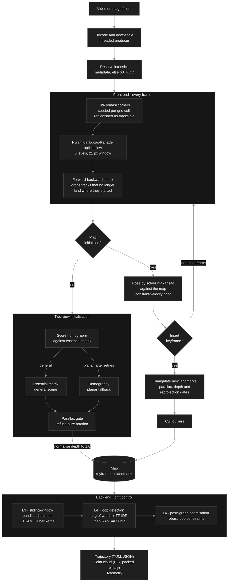
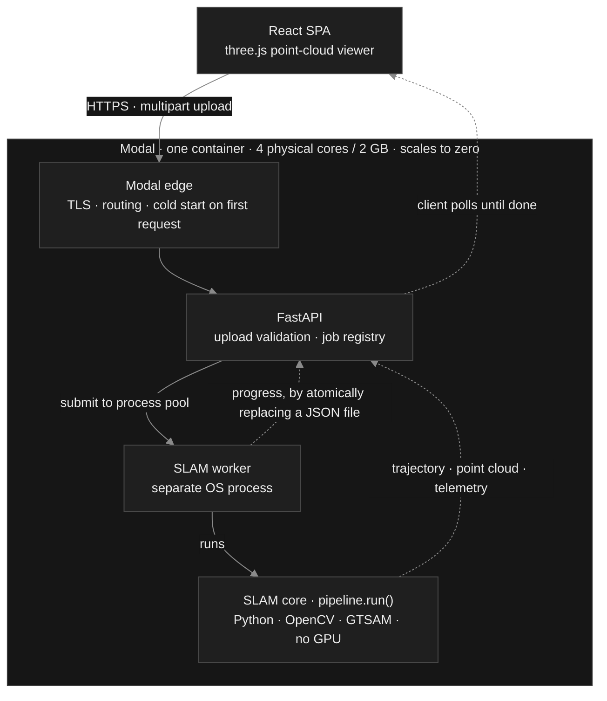

<div align="center">


<br>

[](https://muditagrawal-alt--monocular-slam.modal.run)
[](#-measured-processing-time-and-test-environment)
[](#-setup)
[](#-architecture-and-major-technical-decisions)

[](requirements.txt)
[](requirements.txt)
[](requirements.txt)
[](api/)
[](web/)
[](infra/modal_app.py)

**Recover a camera trajectory and a sparse 3D point cloud from a single-lens RGB video.**<br>
No depth sensor. No GPS. No neural network. No GPU.

[**Open the live app**](https://muditagrawal-alt--monocular-slam.modal.run) · [Watch the demo](docs/media/demo.mp4) · [Architecture](#-architecture-and-major-technical-decisions) · [Benchmarks](#-accuracy)

<sub>O-Hive take-home, Assignment 2 · **Mudit Agrawal**</sub>

</div>

---

<div align="center">


<sub>A 10 second clip, reconstructed in **under 7 seconds on CPU**. The ring is the recovered camera path<br>with a frustum at every keyframe; the cloud inside it is the 3,853 landmarks triangulated along the way.</sub>

</div>

---

## ⚡ What this does

You give it an ordinary video from an ordinary camera. It works out two things
at once, from nothing but the flat 2D frames:

- **Where the camera went**: its full path through 3D space
- **What the scene looks like in 3D**: a sparse cloud of triangulated points

That is circular by nature: knowing where the camera is requires knowing where
the scene is, and vice versa. Solving both together is what SLAM means.

> The whole pipeline is **classical multi-view geometry**. There is no model
> file, no inference, and no GPU anywhere in it. That is what makes a 10 second
> clip finish in under 7 seconds on a CPU container.

| | |
|---|---|
|  | **Upload → track → reconstruct.**<br><br>Corners are tracked frame to frame with optical flow, each camera pose is solved against the map built so far, and bundle adjustment refines poses and structure together.<br><br>Wherever the camera revisits a place, loop closure recognises it and redistributes the accumulated drift. |

---

## 📊 Measured processing time and test environment

The requirement: a 10-second video must process in **10 seconds or less**.

<div align="center">

| | Deployed result |
|---|---|
| Input | 300 frames, 640×360, 30 fps, **10.0 s** |
| **Processing time** | **5.47 to 6.70 s** |
| **Realtime factor** | **0.55× to 0.67×** |
| Consistency | 13 runs across 3 clips, every one within budget |

</div>

**Test environment**: Modal serverless containers, `linux/amd64`, **4 physical
CPU cores / 2 GB**. Python 3.11, OpenCV 4.11 headless, GTSAM 4.2.2. Deployed
settings: 448 px processing width, 560 features, loop-verification cap 100.
**No GPU is present or used.**

The container scales to zero between requests, so the first upload after an
idle period pays a cold start of about 5 seconds before processing begins.
That is container startup, not reconstruction, and the processing times above
exclude it.

<details>
<summary><b>Other clips, same deployment</b></summary>

<br>

| Clip | Length | Processing | Realtime factor |
|---|---:|---:|---:|
| Synthetic orbit | 10.0 s | 5.47 to 6.70 s | 0.55× to 0.67× |
| Real museum walkthrough (closes loops) | 10.0 s | 3.81 to 4.87 s | 0.38× to 0.49× |
| Real street footage, forward motion | 10.0 s | 2.33 to 3.13 s | 0.23× to 0.31× |

**On the spread, because it is not noise.** Within a given container state the
output is bit-identical: six consecutive runs of the museum clip all returned
292 landmarks and 6 loop closures, to the point that only the timing differed.
Across container states it shifts, and the mechanism is the time-aware loop
budget doing its job. A freshly started container runs its early stages more
slowly, so less of the budget is left when loop detection is sized, and it
verifies fewer candidates: that run found 3 loops and 287 landmarks in 3.81 s.
A warmed container reaches the same point with more budget left, spends it on
more verifications, and finds 6 loops and 292 landmarks in 4.87 s. The slower
number is the better reconstruction. Both are within budget, which is the
property the design actually guarantees, and the worst case observed across
every run is 0.67× realtime.

</details>

<details>
<summary><b>Where the time goes, and how it got there</b></summary>

<br>

Measured on the deployment, synthetic orbit clip, on a cold container
(total 5.48 s; a warm one spends its extra headroom on loop detection):

| Stage | Time | Share |
|---|---:|---:|
| Front end (corner seeding, KLT tracking) | 1.36 s | 25% |
| Loop detection and pose graph | 1.35 s | 25% |
| Pose estimation (PnP against the map) | 1.18 s | 22% |
| Bundle adjustment | 1.05 s | 19% |
| Descriptors, mapping, export | 0.40 s | 7% |

The first deployed build took **12.3 s** and missed the budget. Four changes,
each kept only because it was measured:

| Change | Effect |
|---|---|
| Loop detection sized from the time *remaining*, after the map is built | 3135 ms → ~900 ms |
| Bundle-adjustment window 8 → 6, iterations 8 → 5 | 39% cheaper **and more accurate** |
| Processing width 448 | front end −35% |
| Honest per-verification cost estimate | stopped the stage overrunning |

That work was done against 4 vCPU on Fargate, where it landed at 8.4 s. The
current deployment is faster for a reason unrelated to the algorithm: Modal
allocates 4 *physical* cores where 4 Fargate vCPUs are hyperthreads on roughly
two. Loop detection now takes a larger share than it did, which is the
time-aware budget behaving correctly, spending the headroom the faster host
leaves it rather than a fixed allowance.

</details>

Asserted in CI by `tests/performance/test_budget.py`, so a regression past
realtime fails the build.

---

## 🎯 Accuracy

Absolute trajectory error against exact synthetic ground truth, after the 7-DoF
Sim(3) alignment monocular evaluation requires. **Five seeds per configuration.**

<table>
<tr><th>Orbit, 300 frames, camera returns to its start</th><th>Strafe, 240 frames, never revisits</th></tr>
<tr><td>

| Configuration | ATE |
|---|---:|
| Frame-to-map PnP only (L1+L2) | 3.0657 |
| + bundle adjustment (L3) | 0.7343 |
| + loop closure & pose graph (L4) | **0.6416** |
| | **4.78× better** |

</td><td>

| Configuration | ATE |
|---|---:|
| Frame-to-map PnP only (L1+L2) | 1.3277 |
| + bundle adjustment (L3) | **0.0987** |
| + loop closure & pose graph (L4) | 0.0987 |
| | **13.45× better** |

</td></tr>
</table>

Read together: bundle adjustment does most of the work on any sequence, and
loop closure adds more **only where the camera genuinely returns somewhere**.
On the non-looping clip it correctly finds nothing and changes nothing, which is
exactly what you want from a component whose failure mode is warping the whole
map.

### Real footage

**45 arbitrary clips** from Wikimedia Commons: walking tours, cathedral
interiors, cycling, drone flights, driving, hiking, tunnels and palaces.

<div align="center">

| Reconstructed | Median landmarks | Median reprojection | Median realtime factor |
|:---:|:---:|:---:|:---:|
| **42 of 44 valid clips** | 1,052 | 1.02 px | 0.44× |

</div>

The two failures are both severely low-texture: an art installation offering 99
trackable corners and degraded 1906 archival film offering 125, against the 700
to 800 a healthy clip provides. Declining to build a map from those is correct
behaviour, not a gap.

> **Results are reproducible** at a fixed compute budget: four separate
> processes produce identical output. This was not true earlier in development,
> and fixing it is described under [AI Usage](#-ai-usage). The one remaining
> path from timing to output is deliberate: loop detection sizes itself from
> the time left, so a slower host verifies fewer candidates. That trades map
> quality for the budget rather than exceeding it, and is measured under
> [processing time](#-measured-processing-time-and-test-environment).

---

## 🚀 Setup

<table>
<tr><th>Prerequisite</th><th>Version</th><th>Check</th></tr>
<tr><td>Docker</td><td>any recent</td><td><code>docker --version</code></td></tr>
<tr><td>Python <sub>(local dev only)</sub></td><td><b>3.11</b> exactly</td><td><code>python3.11 --version</code></td></tr>
<tr><td>Node <sub>(local dev only)</sub></td><td>20+</td><td><code>node --version</code></td></tr>
</table>

> **Python 3.11 specifically.** GTSAM publishes no wheels for 3.13+, and the
> pinned dependency set is verified against 3.11.

### Run with Docker

```bash
docker compose -f docker/compose.yaml up --build
# open http://localhost:8000
```

### Run locally

```bash
python3.11 -m venv .venv
.venv/bin/pip install -r requirements-dev.txt

.venv/bin/python -m uvicorn api.main:app --reload    # API  → :8000
cd web && npm install && npm run dev                  # UI   → :5173
```

### Tests and checks

```bash
.venv/bin/pytest tests/ -q                            # 78 tests
.venv/bin/ruff check slam/ api/ tests/ benchmarks/
.venv/bin/mypy slam/ api/
```

### Benchmarks

```bash
python benchmarks/ablation.py --frames 300 --seeds 5 --motion orbit
python benchmarks/wild.py --collect 30 && python benchmarks/wild.py --run
python benchmarks/tum.py --sequence freiburg1_xyz      # needs the dataset
```

---

## ☁️ Deployment

**Target: Modal**, which runs the FastAPI app in a serverless container with
real CPU cores and scales to zero between requests.

```bash
npm --prefix web run build        # the image copies web/dist, it does not run node
modal deploy infra/modal_app.py   # build, push, roll out
```

`infra/modal_app.py` wraps the existing app with `@modal.asgi_app()`; nothing in
`api/` or `slam/` changes to deploy it. Three settings carry the reasoning:

| Setting | Value | Why |
|---|---|---|
| `cpu` | 4.0 physical cores | The pipeline runs at roughly 2× parallelism, so 4 leaves headroom for the API to answer progress polls while the worker saturates its cores |
| `max_containers` | 1 | The job registry lives in this process and the client polls for progress. A second container would answer those polls with a 404 |
| `scaledown_window` | 300 s | Long enough to cover a reconstruction and the polling after it, then back to zero so cost tracks real use |

The image is also a plain Docker container (`docker/compose.yaml`), so the
service is not locked to one provider. The AWS scripts from the previous
deployment are kept in `infra/bootstrap.sh` and `infra/deploy.sh`.

<details>
<summary><b>Runtime tuning</b> (the right values depend on how fast the host is)</summary>

<br>

| Variable | Deployed | Purpose |
|---|---|---|
| `SLAM_TARGET_WIDTH` | 448 | Processing width. The main runtime lever |
| `SLAM_MAX_FEATURES` | 560 | Corner budget per frame |
| `SLAM_LOOP_VERIFICATIONS` | 100 | Cap on geometric verifications |
| `SLAM_VERIFY_COST_S` | 0.030 | Assumed cost per verification, for budgeting |
| `SLAM_RTF_TARGET` | 0.80 | Target realtime factor, leaving margin |
| `SLAM_LOOP_CLOSURE` | on | Loop detection and pose-graph correction |
| `SLAM_ADAPTIVE_BUDGET` | off | Mid-flight degradation; see limitations |

Every applied value is reported back in each result, so a run is never
ambiguous about what produced it.

</details>

<details>
<summary><b>Two deployment gotchas worth recording</b></summary>

<br>

**A polling API and a scale-to-zero platform disagree by default.** Uploads
return a job id that the client polls. That only works while every request
reaches the process holding the registry, so the container count is pinned to
one. The same constraint rules out platforms that cannot pin it, which is why
Vercel functions were not an option despite having enough memory and time.

**Buildx attestation broke the Fargate pull.** From the earlier AWS deployment,
kept because it is easy to hit again: the default build produces an OCI image
index with attestation manifests that Fargate cannot pull. Build with
`--provenance=false --sbom=false`.

</details>

---

## 🏗 Architecture and major technical decisions



### Deployment shape



### 1. Classical geometry, not a learned model

The 2025-26 headline monocular systems, MASt3R-SLAM, VGGT-SLAM, SLAM3R, are
dense, transformer-based, and need a CUDA GPU to run at real time. Wrong tool
here for three independent reasons: the assignment asks for a **sparse** cloud,
a GPU task costs far more and complicates deployment, and the 10-second budget
is achievable on CPU classically.

So: **no machine-learning model at all.** Shi-Tomasi corners, Lucas-Kanade
optical flow, essential and homography matrices, PnP with RANSAC, linear
triangulation, bundle adjustment, pose-graph optimisation. Even the
loop-closure vocabulary is built by k-means over the video's own descriptors at
runtime, so nothing pretrained ships with it.

### 2. Track with optical flow, describe only at keyframes

The single largest performance decision, benchmarked *before* committing
(`benchmarks/feasibility/`), single core at 640×360:

| Front end | Cost per frame |
|---|---:|
| ORB detect + describe + BFMatcher + RANSAC | 27.5 ms |
| **Shi-Tomasi + pyramidal KLT** | **4.3 ms** |

Roughly **6× cheaper**. Descriptors are computed only at keyframes, where they
are genuinely needed for loop-closure retrieval.

### 3. Drift control is layered

No single mechanism is sufficient:

| Layer | Mechanism | What it addresses |
|:---:|---|---|
| **L1** | RANSAC everywhere, Huber kernels, forward-backward track check, landmark culling | Outliers, before they corrupt the map |
| **L2** | Frame-to-map PnP rather than frame-to-frame chaining | Pose error compounding through integration |
| **L3** | Sliding-window bundle adjustment | Local error growth in poses and structure |
| **L4** | Loop detection + global pose-graph optimisation | Error already accumulated over the sequence |

Loop detection runs cheap-to-expensive, because a false loop warps the whole
map and is far worse than a missed one: bag-of-words retrieval with TF-IDF
weighting, fused by reciprocal rank with proximity in the current estimate,
then descriptor matching with RANSAC PnP against mapped landmarks, then a
consistency requirement that strong geometric support can override.

### 4. Latency is handled where it does no harm

An earlier design degraded the map mid-stream when it projected an overrun.
That made accuracy depend on machine load. The same clip scored **0.76 ATE on
an idle machine and 3.75 when the guard fired under contention**, so it is now
**off by default**.

Instead, loop detection sizes its own budget from the time actually remaining.
It runs *after* the frame loop, so the map is already built and correct, and the
remaining budget is known exactly. Full detection quality when there is time;
detection is given up rather than the deadline when there is not.

### 5. Process isolation for the worker

SLAM is CPU-bound for seconds at a time, so it runs in a separate **process**,
not a thread: a thread would contend on the GIL with the event loop and make
progress polling unresponsive. Progress is reported by atomically replacing a
small JSON file rather than over a multiprocessing queue, because a `Manager`
queue needs a broker process that re-imports `__main__`, which is fragile under
the `spawn` start method used on macOS and in containers.

---

## 📦 Libraries, frameworks and external components

### Runtime

| Component | Version | Role |
|---|---|---|
| Python | 3.11 | GTSAM publishes no wheels for 3.13+ |
| OpenCV (headless) | 4.11.0.86 | Corners, optical flow, PnP, epipolar geometry, video I/O |
| GTSAM | 4.2.2 | Factor-graph optimisation: bundle adjustment and pose graph |
| NumPy | 1.26.4 | Array maths throughout |
| SciPy | 1.14.1 | Spatial helpers |
| FastAPI | 0.115.6 | HTTP API |
| uvicorn | 0.34.0 | ASGI server |
| Pydantic | 2.10.4 | Request and response models |

> **The pins are load-bearing.** GTSAM 4.2.2 requires `numpy<2`, which forces
> `opencv<=4.11.x`. Bumping either alone breaks the environment. The same
> constraint rules out `rerun-sdk` (needs `numpy>=2`), which is why the viewer
> is custom rather than an off-the-shelf visualiser.

### Frontend

React 18 · TypeScript 5.7 · Vite 6 · Tailwind CSS v4 · react-three-fiber and
drei over three.js · Phosphor icons. Built as a static bundle and served by the
same container, so there is one origin and no CORS in production.

### Development

pytest · ruff · mypy · httpx · evo (trajectory metrics) · Playwright · Docker ·
GitHub Actions.

### Pretrained models

**None.** No neural network, no weights file, no downloaded checkpoint, no
inference of any kind. Stated explicitly because it is unusual for a 2026
vision project, and it is the reason the service needs no GPU.

### External data

Wikimedia Commons video (CC BY-SA and public domain) for the wild benchmark;
each clip's source and licence is recorded in [`samples/README.md`](samples/README.md).
The TUM RGB-D benchmark is supported but its dataset is not redistributed here.
Demo music: *"Placid Ambient"* by MusicLFiles, CC BY 4.0.

---

## 🔍 Known limitations and what I would improve with more time

### Inherent to monocular SLAM

| Limitation | Why | How it could be lifted |
|---|---|---|
| **Scale is unobservable** | One moving camera cannot recover absolute size; a real room and a perfect dollhouse produce identical images | Show one object of known size, or add stereo / depth / IMU / GPS |
| **No calibration on an upload** | Focal length comes from metadata when present, else a 60° FOV assumption with a UI override | Estimate focal length as a free variable in a final global bundle adjustment |
| **Degenerate motion is refused** | Pure rotation gives no baseline, so no depth information exists | Not possible. This is geometry, not implementation |
| **The world is assumed static** | Crowds and traffic violate the rigid-scene assumption | Mask moving regions with segmentation, reintroduces a GPU dependency |

### What I would fix first

- **Loop closure is under-sensitive.** Fires on roughly 1 in 5 synthetic
  sequences and 8 of 42 real clips. The bias is deliberate, since a false loop
  warps the entire map, but retrieval is the weak link. *Fix:* a proper DBoW2-style
  vocabulary tree trained offline instead of online k-means.
- **Tracking robustness on real footage.** Only 20 of 42 real clips track with
  no loss at all. Losses trigger re-initialisation, so the trajectory becomes
  segmented. *Fix:* relocalisation against the existing map rather than
  starting fresh.
- **Accuracy validation is synthetic.** The TUM RGB-D harness is built and
  tested end to end against a synthetic sequence in exact TUM layout, but the
  dataset host was unreachable from the development network, so no
  real-benchmark ATE numbers exist. *Fix:* run `benchmarks/tum.py` from a
  network that can reach it.
- **Sparse means sparse.** About 1 point per 400 pixels: enough to localise,
  not enough to look like a scene. *Fix:* a densification pass once poses are
  known, as an optional high-quality mode.
- **Forward motion is weak geometry.** Moving along the optical axis gives
  little parallax, so those clips yield thinner maps. Inherent, but a wider
  baseline keyframe policy would help.
- **Host speed varies, and the settings are tuned per host.** The same image
  measured 6.5 s on one Fargate host and 10.0 s on another, and moving to Modal
  changed the numbers again. Processing width and the feature budget are
  environment variables for exactly this reason, but choosing them is still
  manual. *Fix:* calibrate at startup with a short synthetic benchmark.
- **Cold starts are visible.** The container scales to zero, so the first
  upload after an idle period waits about 5 seconds for startup before
  processing begins. *Fix:* keep one container warm, at the cost of paying for
  idle time.

---

## 🤖 AI Usage

### Tools

**Claude Code** (Anthropic) was used throughout as a development assistant, for
implementation, benchmark tooling, and documentation. Everything it produced
was checked against measurement before being kept.

### How it was used

The method was to treat the assistant as a fast implementer and a tireless
measurer, and to keep engineering judgement, direction and acceptance criteria
on my side:

- **I set the constraints and the order of work**: build and verify locally
  before touching any cloud; deployment as a gated step rather than something
  interleaved; benchmark against real footage, not only synthetic fixtures;
  polish last, after the substance was proven.
- **I required claims to be reproducible before accepting them.** This is what
  exposed the most important defect in the project, below.
- **I chose the deployment target** after reviewing the CPU evidence, and
  directed the latency work when the deployed service missed the budget.
- The assistant did the implementation, ran the sweeps, and drafted the docs.

### Recommendations adopted, after they survived measurement

| Decision | Why it was kept |
|---|---|
| Classical geometry over a learned dense model | The assignment asks for a *sparse* cloud, and a CPU pipeline hits the 10 s budget where MASt3R-SLAM or VGGT-SLAM would need a GPU |
| KLT optical flow every frame, descriptors only at keyframes | 4.3 ms/frame against 27.5 ms for ORB matching. This one decision is why the budget is met at all |
| GTSAM for bundle adjustment and pose graph | pip-installable with the right wheels, and never became a bottleneck |
| Layered drift control (L1-L4) | The ablation shows each layer earning its place: 4.78× on a looping sequence, 13.45× on a straight one |
| Homography initialisation as a *gated fallback* | Recovered drone and other planar footage that was previously refused outright |

### Recommendations rejected or modified

The more informative half. Each was rejected on evidence, not taste:

| What was proposed | What happened to it |
|---|---|
| **Adaptive mid-flight quality degradation** to protect the deadline | **Rejected, disabled by default.** It made accuracy depend on machine load: 0.76 ATE on an idle machine against 3.75 when it fired under contention. Latency is now handled by sizing loop detection from the time remaining *after* the map is built |
| **Capping bundle-adjustment landmarks at 250** | **Rejected.** Degraded the orbit sequence to 4.9054 ATE, far worse than the time it saved |
| **Halving the forward-backward track check** for 25% off the front end | **Rejected.** Looked free on one seed, then cost 17% accuracy across five. A reminder that one measurement is not a result |
| **Bundle adjustment every third keyframe** for the deployed build | **Rejected.** 88% worse on the orbit sequence. A shorter BA window was found instead, faster *and* more accurate |
| An early ablation reporting **"5.10× drift improvement"** | **Rejected as unreproducible.** Re-running the exact commit gave a different figure. Cause: unseeded RANSAC plus the adaptive guard reacting to load. Both fixed; every number here was re-measured from scratch afterwards |

> Insisting that results reproduce before accepting them is what exposed the
> reproducibility defect. Until it was fixed, the headline accuracy figures were
> not trustworthy, and no amount of further implementation would have made them
> so. Four separate processes now produce identical output, which is the
> precondition for any measurement here meaning anything.

---

## 📁 Repository layout

```
slam/                 core library, no web or cloud dependencies
  camera.py           pinhole model and intrinsics resolution
  geometry.py         triangulation, parallax, Sim(3) alignment
  types.py            poses, keyframes, landmarks, the map
  config.py           all tunable parameters, and env overrides
  pipeline.py         orchestration
  core/               feature tracking, initialisation, PnP tracking, mapping
  optim/              bundle adjustment, loop closure, pose graph
  io/                 video decode, image sequences, synthetic fixture, exporters
api/                  FastAPI service and job manager
web/                  React + TypeScript viewer
tests/                unit, integration, performance
benchmarks/           feasibility, ablation, wild-video and TUM harnesses
docker/               image and compose file
infra/                bootstrap and deploy scripts
docs/                 implementation plan, design brief, capture guide, media
```

### Further reading

| Document | What is in it |
|---|---|
| [IMPLEMENTATION_PLAN.md](IMPLEMENTATION_PLAN.md) | The original plan, and a note on where it met reality |
| [docs/CAPTURE_GUIDE.md](docs/CAPTURE_GUIDE.md) | How to record a video that reconstructs well |
| [docs/DESIGN_BRIEF.md](docs/DESIGN_BRIEF.md) | How the UI design was derived |
| [samples/README.md](samples/README.md) | Sample clips, their sources and licences |

---

<div align="center">

**[Open the live app →](https://muditagrawal-alt--monocular-slam.modal.run)**

<sub>Built by Mudit Agrawal · O-Hive take-home, Assignment 2</sub>

</div>
